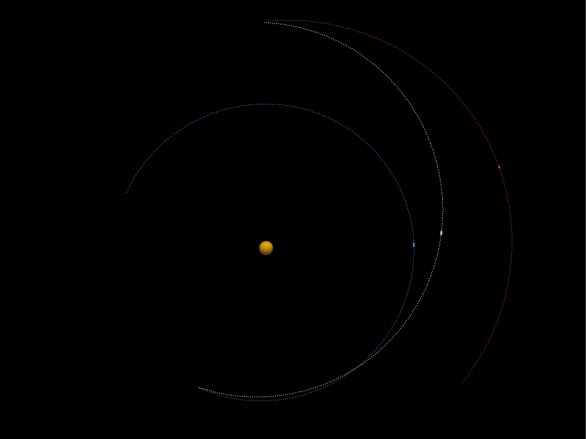

# Fuji
An astronomical orbit calculator and visualizer tool

*Visualization shows Earth to Mars transfer orbit*

### Features

* Uses a Lambert solver to calculate the trajectory required to reach any planet
* Uses a Verlet integrator to solve N-body dynamics
* Uses SPICE ephemerides to demonstrate Earth–Moon and Earth–Mars transfers
* Uses PyVista to visualize the orbital motion of an N-body system
